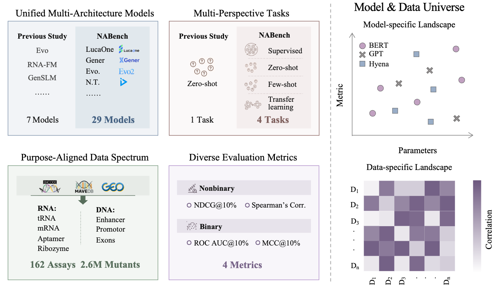

# Large-scale Benchmarks of Nucleotide Foundation Models for Fitness Prediction

<div align="center">
<h3>
NABench
</h3>
</div>

<div align="center">
<h4>
  📄 <a href="https://openreview.net/forum?id=d0gvsym66h" target="_blank">Paper</a> ｜ 💻 <a href="https://github.com/mrzzmrzz/NABench" target="_blank">Code</a> | 📚 <a href="https://anonymous.4open.science/r/NABench-20CB/" target="_blank">Resources</a> 
</h4>
</div>

## Overview

Variations in nucleotide sequences often lead to significant changes in fitness. Nucleotide Foundation Models (NFMs) have emerged as a new paradigm in fitness prediction, enabling increasingly accurate estimation of fitness directly from sequence. However, assessing the advantages of these models remains challenging due to the use of diverse and specific experimental datasets, and their performance often varies markedly across different nucleic acid families, complicating **fair comparisons**.

To address this challenge, we introduce **NABench**, a large-scale, systematic benchmark specifically designed for nucleic acid fitness prediction. NABench integrates **2.6 million** mutant sequences from **162** high-throughput assays, covering a wide range of DNA and RNA families. Within a standardized and unified evaluation framework, we rigorously assess **29** representative nucleotide foundation models.

NABench's evaluation covers a variety of complementary scenarios: **zero-shot prediction**, **few-shot adaptation**, **supervised training**, and **transfer learning**. Our experimental results quantify the heterogeneity in model performance across different tasks and nucleic acid families, revealing the strengths and weaknesses of each model. This curated benchmark lays the groundwork for the development of next-generation nucleotide foundation models, poised to drive impactful applications in cellular biology and nucleic acid drug discovery.

Figure 1: The NABench Benchmark Framework.

<div align="center">

</div>

## Leaderboard

Our comprehensive evaluation reveals a complex and interesting performance landscape where no single model or architectural family dominates across all settings. The most striking finding is a clear **performance dichotomy** between different architectural families across zero-shot and supervised settings.

-   In the zero-shot setting, **autoregressive models** (e.g., GPT-like) and **state-space models** (e.g., Hyena/Evo series) show a clear advantage.

-   When labeled data is introduced, in supervised and few-shot scenarios, many **BERT-like models** demonstrate a remarkable ability to learn, often outperforming the generative models.

This suggests fundamental differences in the nature of the representations learned by these architectures. Detailed performance files and more in-depth analyses (e.g., breakdowns by nucleic acid type, mutational depth) can be found in the benchmarks folder.

Figure2?

## Baseline Models

Our benchmark evaluates a total of 27 nucleotide foundation models, which are categorized into four main architectural classes: **BERT-like**, **GPT-like**, **Hyena**, and **LLaMA-based**.

| Model | Params | Max Length | Tokenization | Architecture |
|---|---|---|---|---|
| [LucaVirus](https://github.com/LucaOne/LucaVirus) | 1.8B | 1280 | Single | BERT |
| [Evo2-7B-base](https://github.com/ArcInstitute/evo2) | 7B | 8192 | Single | Hyena |
| [Evo2-7B](https://github.com/ArcInstitute/evo2) | 7B | 131072 | Single | Hyena |    
| [Evo-1-8k](https://github.com/evo-design/evo) | 6.45B | 8192 | Single | Hyena |
| [Evo-1-8k-base](https://github.com/evo-design/evo) | 6.45B | 131072 | single | Hyena |
| [GENA-LM](https://github.com/AIRI-Institute/GENA_LM) | 336M | 512 | k-mer | BERT |
| [N.T.v2](https://github.com/instadeepai/nucleotide-transformer) | 500M | 2048 | k-mer | BERT |
| [N.T.v2](https://github.com/instadeepai/nucleotide-transformer) | 50M | 2048 | k-mer | BERT |
| [CRAFTS](https://github.com/SaisaiSun/RLaffinity) | 161M | 1024 | Single | GPT |
| [LucaOne](https://github.com/LucaOne/LucaOne) | 1.8B | 1280 | Single | BERT |
| [AIDO.RNA](https://github.com/genbio-ai/AIDO) | 1.6B | 1024 | Single | BERT |
| [BiRNA-BERT](https://github.com/buetnlpbio/BiRNA-BERT) | 117M | dynamic | BPE | BERT |
| [Evo-1.5](https://github.com/evo-design/evo) | 6.45B | 131072 | Single | Hyena |
| [GenSLM](https://github.com/ramanathanlab/genslm) | 2.5B | 2048 | Codon | BERT |
| [HyenaDNA](https://github.com/HazyResearch/hyena-dna) | 54.6M | up to 1M | Single | Hyena |
| [N.T.](https://github.com/instadeepai/nucleotide-transformer) | 500M | 1000 | k-mer | BERT |
| [RFAMLlama](https://github.com/JinyuanSun/RFamLlama) | 88M | 2048 | Single | GPT |
| [RNA-FM](https://github.com/ml4bio/RNA-FM) | 99.52M | 1024 | Single | BERT |
| [RNAErnie](https://github.com/CatIIIIIIII/RNAErnie) | 105M | 1024 | Single | BERT |
| [GenerRNA](https://github.com/pfnet-research/GenerRNA) | 350M | dynamic | BPE | GPT |
| [DNABERT](https://github.com/jerryji1993/DNABERT) | 117M | dynamic | k-mer | BERT |
| [RINALMo](https://github.com/lbcb-sci/RiNALMo) | 650M | 1022 | Single | BERT |
| [Enformer](https://github.com/google-deepmind/deepmind-research/tree/master/enformer) | 251M | 196608 | Single | BERT |
| [SPACE](https://github.com/ZhuJiwei111/SPACE) | 588M | 131072 | Single | BERT |
| [GENERator](https://github.com/GenerTeam/GENERator) | 3B | 16384 | 6-mer | GPT |
| [RESM](https://github.com/yikunpku/RESM) | 150M/650M | -- | Single | BERT |
| [structRFM](https://github.com/heqin-zhu/structRFM) | 86M | 512 | Single | BERT |


## Resources

Resources
You can download all benchmark datasets and model scores. Please replace {FILENAME} with the specific file you wish to download.

For example, you can download and unzip all processed DMS assay data using the following command:

```bash
FILENAME="NABench_DMS_assays.zip"
curl -o ${FILENAME} https://your-hosting-url/NABench/${FILENAME} # Please replace with your data hosting URL
unzip ${FILENAME} && rm ${FILENAME}
```
| Data | Size (unzipped) | Filename |
|---|---|---|
| DMS Assays (processed) | 50MB | NABench_DMS_assays.zip |
| SELEX Assays (processed) | 2.1GB | NABench_SELEX_assays.zip |
| Zero-shot Scores (DMS) | 1.5GB | zero_shot_DMS_scores.zip |
| Zero-shot Scores (SELEX) | 8.0GB | zero_shot_SELEX_scores.zip |
| Supervised Scores | 1.2GB | supervised_scores.zip |
| Cross-Validation Folds | 200MB | cv_folds.zip |
| Raw Data | 2.5GB | raw_data.zip |

## How to Contribute

### New Assays
If you would like to suggest a new fitness dataset to be included in NABench, please open an issue with the new_assay label. We typically consider the following criteria for inclusion:
1. The corresponding raw dataset must be publicly available.
2. The assay must be related to nucleic acids (DNA/RNA).
3. The dataset needs to have a sufficient number of variant measurements.
4. The assay should have a sufficiently high dynamic range.
5. The assay must be relevant to fitness prediction.

### New Baselines
If you would like to include a new baseline model in NABench, please follow these steps:
1. Submit a Pull Request containing:
-   A new subfolder under scripts/ named after your model. This folder should contain a scoring script seq_emb.py and a run script seq_emb.sh, similar to other models in the repository.
-   All code dependencies required for the scoring script to run properly.
2. Open an issue with the new_model label, providing instructions on how to download relevant model checkpoints and reporting your model's performance on the relevant benchmark using our performance scripts.

Currently, we are only considering models that meet the following conditions:
1. The model is able to score all mutants in the relevant benchmark.
2. The corresponding model is open-source to allow for reproducibility.

## Usage and Reproducibility

Environment Setup
We recommend using Conda to create and manage your Python environment:
```bash
# (Recommended) Create environment with conda
conda create -n nabench python=3.9
conda activate nabench

# Install dependencies with pip
pip install -r requirements.txt
```
Alternatively, you can use poetry or another package manager with the pyproject.toml file.

Download Data
Download the necessary data from the Resources section above and unzip it into your project's root directory or a specified path.

Generate Sequence Embeddings
Our scripts directory provides a standardized embedding extraction pipeline for each model. To generate embeddings for a specific model, run:
```bash
# Example for DNABERT
bash scripts/dnabert/seq_emb.sh path/to/input/data.csv path/to/output/embeddings.pt
```
Please refer to the README or script comments in each model's directory for detailed parameters.

Evaluate Model Performance
After generating embeddings/scores for all models, you can use our evaluation scripts to compute performance metrics.
```bash
# Example command (specific script to be provided by you)
python evaluate.py --scores_dir path/to/scores --output_dir benchmarks/
```
This script will generate detailed performance reports, including metrics aggregated by different dimensions (e.g., nucleic acid type, evaluation setting).


## Acknowledgements

We thank all the researchers and experimentalists who developed the original assays and foundation models that made this benchmark possible. We also acknowledge the invaluable contributions of the communities behind **ProteinGym** and **RNAGym**, which heavily inspired this work.

Please consider citing the corresponding papers of the models and datasets you use from this benchmark.

## Citation
If you use NABench in your work, please cite the following paper:

```bibtex
@article{nawork2024,
  title={NABench: Large-Scale Benchmarks of Nucleotide Foundation Models for Fitness Prediction},
  author={Antiquus S. Hippocampus and Natalia Cerebro and Amelie P. Amygdale and Ji Q. Ren and Yevgeny LeNet},
  year={2024},
  journal={ICLR 2026 Conference Track on Datasets and Benchmarks}
}
